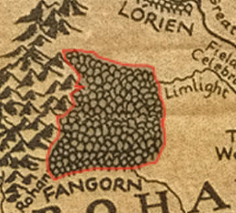

# LordOfTheRingsInteractiveMap

Welcome to the Lord of the Rings Interactive Map project! This project is an interactive representation of the world of Middle-earth as depicted in J.R.R. Tolkien's iconic Lord of the Rings series. Explore the rich landscapes and key locations, each imbued with intricate details and historical significance.

This project was one of my first projects when I first learned how to code in Javascript. It is a few years old, and does contain a few bugs from time to time. Please refer to the "How do I test it out section?".

## Features
- Interactive map of Middle-earth
- Detailed descriptions of key locations
- Clickable points of interest with pop-up information

## Clickable Locations

Here is a comprehensive list of all the clickable locations featured on the map:

1. The Shire
2. Bree
3. The Old Forest
4. Rivendell
5. Moria
6. Lorien
7. The Great River Anduin
8. Fangorn Forest
9. Edoras
10.Helm's Deep
11. Isengard
12. Dead Marshes
13. North Ithilien
14. Minas Morgul
15. Minas Tirith
16. Paths of the Dead
17. Pelargir
18. Grey Havens
19. Mount Doom

## How do I test it out?
To test this project, you can either install it locally (as shown below) or run it using the following link:

- https://rawcdn.githack.com/yonatanbensimon/LordOfTheRingsInteractiveMap/8d7d2062d8930a53c06f0077b5a15b73ade6e54f/HTML/map.html

**It is very important to note that**

1. Most of the time, when opening the link, the map won't be clickable. Usually, after refreshing the web page **one time**, the map becomes clickable. (Trying to press on Fangorn Forest is usually a good test to determine if the map is clickable or not, as you should be able to see the area hovered in red, as shown in the image below). If the map still does not work, restart your browser or pick a different browser.
   

</img>

2. When you load the map, the map canvas automatically detects the size of the browser. If the size of the browser changes, you will have to open a new tab.
3. This map was tested using the Safari, Opera and Chrome browsers.
   
### Installation

To run this project locally, please follow these steps:

1. Clone the repository
2. Open the map.html file in the HTML/ folder in your web browser.

## Contributing
Contributions to this project are welcome! Feel free to open issues or submit pull requests with improvements.

## License
This project is licensed under the MIT License. See the LICENSE file for more information.

Acknowledgements
Special thanks to J.R.R. Tolkien for inspiring generations with the epic tales of Middle-earth and to all the contributors working on this project.
